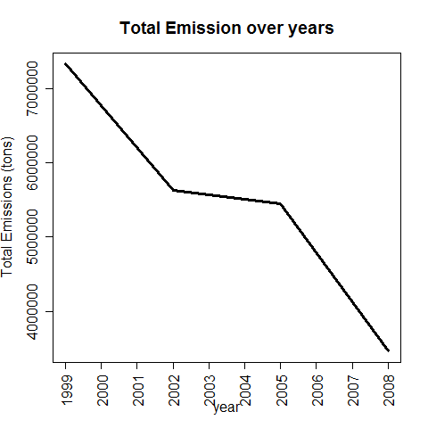
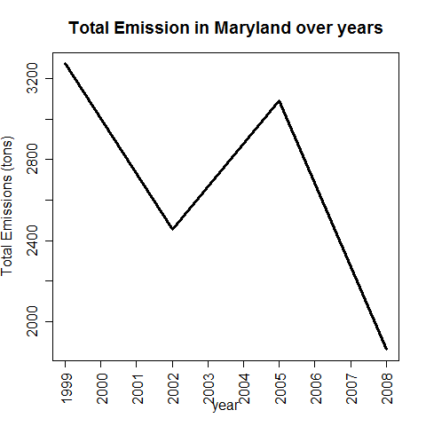

#Course Project 2

This R Markdown document shows some important code snippets used in Exploratory Data Analysis: Course Project 2.
```{r message=FALSE}
#we will be using some packages/libs
library(dplyr)

```


##Task 1: 
###*Have total emissions from PM2.5 decreased in the United States from 1999 to 2008? Using the base plotting system, make a plot showing the total PM2.5 emission from all sources for each of the years 1999, 2002, 2005, and 2008?*

We need to group the data by year and then sum up the emissions.
```{r cache=TRUE, eval=FALSE}
pollByYear <- NEI %>% group_by(year) %>% summarise(sum(Emissions))
plot(pollByYear, type = 'l', ylab = "Total Emissions (tons)", xaxt = 'n', main = "Total Emission over years")
axis(1, at = seq(1999, 2008, 1), las = 2)
```

  

>   Answer: From the graph we see a downward trend in emissions over the years. So **yes** the emissions have reduced. 


##Task 2:
###*Have total emissions from PM2.5 decreased in the Baltimore City, Maryland (fips == "24510") from 1999 to 2008? Use the base plotting system to make a plot answering this question?*

We will `filter` out data for the `fips` and then repeat the previous plot.
```{r cache=TRUE, eval=FALSE}
pollMaryland <- NEI %>% filter(fips == "24510") %>% group_by(year) %>% summarise(sum(Emissions))
plot(pollMaryland, type = 'l', ylab = "Total Emissions (tons)", xaxt = 'n', lwd = 3,
     main = "Total Emission in Maryland over years")
axis(1, at = seq(1999, 2008, 1), las = 2)
dev.copy(png, "TotalEmission_Maryland.png")
dev.off()
```

  

>   Answer: From the graph we see a downward trend in emissions over the years, Although the emissions increased in year 2005, the levels are lower in 2008. We can agree that the emissions have reduced. 

